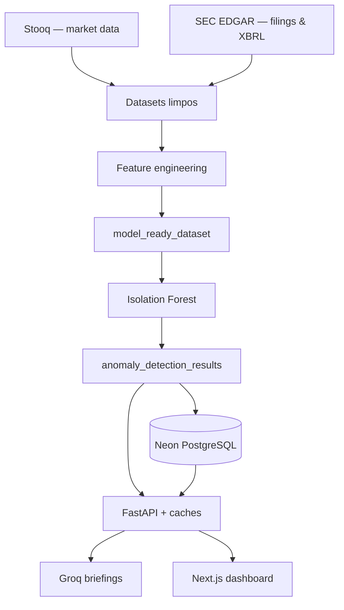
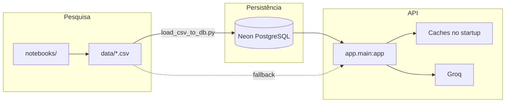

<p align="center">
  
</p>

<h1 align="center">Corporate Signal Intelligence</h1>

<p align="center">
  <strong>SEC filings · market features · Isolation Forest · FastAPI · Groq · Neon PostgreSQL</strong><br />
  <em>De notebooks e dor de cabeça com API de mercado até uma API em produção no Render.</em>
</p>

<p align="center">
  <a href="https://github.com/sidnei-almeida/corporate-signal-intelligence"><strong>Ver no GitHub</strong></a>
  &nbsp;·&nbsp;
  <a href="README_API.md">Documentação da API</a>
  &nbsp;·&nbsp;
  <a href="README_DATABASE.md">Banco de dados (Neon)</a>
</p>

<p align="center">
  
  
  
  
  
  
</p>

---

## O que é isso

Montei este projeto para juntar **dados de mercado**, **filings da SEC** e **fundamentos financeiros** num único fluxo: limpar, gerar features, detectar dias atípicos com Isolation Forest e expor tudo numa API — com briefings executivos via Groq quando faz sentido.

Não é robô de trade nem parecer jurídico. A ideia é **priorizar o que merece uma segunda olhada** antes de alguém abrir um 10-K ou montar um memo.

> **API em produção:** `uvicorn app.main:app` — detalhes em [README_API.md](README_API.md).

---

## Como o projeto foi construído

Esta seção é o resumo honesto do caminho — incluindo o que quebrou.

### Pipeline final



---

### 1. Coleta de mercado — Alpha Vantage não segurou

Comecei com **Alpha Vantage** porque parecia simples: `open`, `high`, `low`, `close`, `volume`, `adjusted_close`, etc.

Na prática:

- `TIME_SERIES_DAILY_ADJUSTED` → erro de endpoint **premium**
- `TIME_SERIES_DAILY` com `outputsize=compact` → só ~**100 linhas** por ticker
- `outputsize=full` → **503**, quota estourando rápido

**Conclusão:** descartei como fonte principal. No máximo complemento.

---

### 2. Coleta de mercado — Stooq virou a base

Migrei para **Stooq** (CSV histórico). No começo a Stooq nem devolvia o arquivo — pedia API key via captcha. Depois da key, a coleta fluiu.

**10 tickers:** AAPL, MSFT, NVDA, GOOGL, AMZN, META, TSLA, AMD, INTC, ORCL.

| Métrica | Valor |
|---------|--------|
| Linhas históricas (aprox.) | ~82 mil |
| Granularidade | Diária |
| Cobertura | Décadas em alguns casos (ex.: INTC desde 1972, AAPL desde 1984) |

**Stooq = fonte principal de market data.**

---

### 3. Coleta corporativa — SEC EDGAR

A parte “corporate intelligence” veio da **SEC**: metadata, ticker→CIK, submissions, 10-K / 10-Q / 8-K, company facts (XBRL).

Primeiro teste com AAPL funcionou (`CIK 0000320193`). Conceitos como `Revenues`, `NetIncomeLoss`, `Assets`, `CashAndCashEquivalentsAtCarryingValue` aparecem com nomes diferentes entre empresas e períodos.

**Pegadinha que parecia bug:** `start_date` como `NaT` em vários facts. Não era erro — é o modelo da SEC:

| Tipo | Datas |
|------|--------|
| **Duration** (receita, lucro) | `start_date` + `end_date` |
| **Instant** (ativos, caixa) | em geral só `end_date` |

Passei a usar **`reference_date` / `end_date`** como eixo temporal dos fundamentals.

---

### 4. Limpeza — `data_analysis_cleansing.ipynb`

Objetivo: validar shape, duplicatas, nulos, padronizar tickers e datas.

| Dataset limpo | Resultado |
|---------------|-----------|
| `clean_market_df` | Sem nulos/duplicatas relevantes; filtrado de **2015+** |
| `clean_companies_df` | OK |
| `clean_sec_filings_df` | OK |
| `clean_sec_facts_df` | `start_date` nulo onde esperado (instant concepts) |

---

### 5. Feature engineering — três camadas

No `feature_engineering.ipynb` separei em três blocos.

**Market features** — retornos, volatilidades, z-scores de volume/retorno, gaps, etc.  
→ **2.773 linhas** por ticker, período alinhado (2015–2026).

**Filing features** — contagens de 10-K/10-Q/8-K, janelas 30d/90d/180d/365d, dias desde último filing.  
→ SEC virando **sinal diário**, não só PDF no EDGAR.

**Financial features** — a parte mais chata. XBRL em formato longo, conceitos que mudam de nome (`RevenueFromContractWithCustomerExcludingAssessedTax` vs `Revenues`). Consolidei em `revenue`, margens, crescimentos QoQ/YoY, etc.

Depois do primeiro pivot ficou **esparsão brutal** (>50% missing em várias colunas). A v2:

- mapear conceitos **antes** do pivot  
- forward fill por ticker  
- consolidar `ticker + reference_date`  
- dropar colunas ainda ruins (`liabilities*`, ~40% missing)

Saída: `financial_features_selected.csv`.

---

### 6. `model_ready_df` — merge e missing values

União em duas etapas:

1. **Diário:** `market_features` + `filing_features` em `ticker + date`  
2. **Financeiro trimestral:** `merge_asof` — para cada dia de mercado, o último fundamental disponível até aquela data

| | |
|---|---|
| Linhas | 27.730 |
| Colunas | 58 |
| Empresas | 10 |

Testei `dropna()` completo: perderia **15,6%** das linhas e **100% da AMZN**. Descartado.

**Decisão:** `SimpleImputer(median)` dentro do pipeline de modelagem — mantém todas as empresas.

---

### 7. Modelagem — Isolation Forest

Sem labels reais de “fraude” ou “crise”, faz mais sentido **não supervisionado**.

```text
SimpleImputer(median) → RobustScaler() → IsolationForest(contamination=0.03)
```

Salvo em `models/isolation_forest_anomaly_pipeline.joblib`.

Taxa global de anomalia: **3,00%** (bate com `contamination=0.03`).

| Ticker | Taxa de anomalia |
|--------|------------------|
| TSLA | 7,46% |
| NVDA | 6,60% |
| META | 4,36% |
| GOOGL | 3,53% |
| AAPL | 0,79% |

TSLA e NVDA no topo faz sentido — mais volatilidade e eventos extremos no recorte.

---

### 8. Tipos de anomalia (rule-based)

Depois do score do modelo, classifiquei com regras: `price_spike`, `volume_spike`, `high_volatility`, `filing_activity`, `revenue_shift`, `negative_margin`, `combined_signal`, etc.

O primeiro gráfico com tipos **concatenados** virou sopa ilegível (`price_spike, volume_spike, filing_activity, ...`). Ajuste: **explodir labels individuais** — leitura muito melhor.

---

### 9. API FastAPI

Estruturei em `app/` (não o `app.py` legado da primeira versão):

| Área | Endpoints |
|------|-----------|
| Sistema | `/health`, `/` |
| Empresas | `/companies`, `/companies/{ticker}` |
| Anomalias | `/anomalies`, `/top`, `/summary`, `/types`, `/{ticker}` |
| Modelo | `/model/info`, `/model/predict` |
| Briefings | `/briefings/generate`, `/generate-from-record`, `/sample` |

**Estratégia de dados:** v1 com CSV local para deploy rápido → depois **Neon** com `DATA_SOURCE=auto|database|csv`.

**Groq** (`llama-3.3-70b-versatile`): recebe o registro da anomalia e devolve briefing executivo — o que aconteceu, por que importa, sinais, monitoramento — **sem recomendação de investimento**.

---

### 10. Deploy no Render — o que deu trabalho

Subiu e respondeu, mas apareceram dois problemas clássicos:

**Rotas 200/404 alternando** — `/anomalies/summary` às vezes caía em `/{ticker}`. Corrigi ordem das rotas (estáticas antes das dinâmicas), `normalize_ticker`, validação de ticker e cache sem mutação.

**RAM > 512 MB** — Pandas carregando CSV largo, `.copy()`, `groupby` e `explode` a cada request no free tier. Não é data leakage; é limite de memória + design inicial.

Mitigações que aplicamos:

- caches leves no startup (summary, top, types, perfis)  
- colunas mínimas / SQL no Neon  
- `/health` e `/model/info` sem carregar joblib  
- `--workers 1`  
- produção com **`DATA_SOURCE=database`** quando o Neon está populado  

---

### 11. Neon + dashboard

Schema PostgreSQL, SQLAlchemy, Alembic, `scripts/load_csv_to_db.py` — ~27k linhas em `anomaly_results`. A API em produção já lê do banco quando `DATABASE_URL` está configurado.

Frontend em repo separado: **[corporate-signal-intelligence-dashboard](https://github.com/sidnei-almeida/corporate-signal-intelligence-dashboard)** — Next.js, Tailwind, Recharts. Fluxo: escolher empresa → ver anomalias → gerar briefing Groq.

---

### O que funcionou vs. o que não

| Funcionou | Não funcionou (ou evitar) |
|-----------|---------------------------|
| **Stooq** — histórico profundo | **Alpha Vantage** — quota, 503, premium |
| **SEC EDGAR** — dados corporativos reais | **`dropna()`** no `model_ready` — mata AMZN |
| **Pandas nos notebooks** | **Pandas pesado na API** no Render 512MB |
| **Isolation Forest** — baseline sólido | **Gráfico com `anomaly_type` combinado** — ilegível |
| **Groq** — briefings úteis | Carregar `model_ready` inteiro na API |
| **FastAPI** + OpenAPI | |
| **Neon** como fonte em produção | |

---

### Em uma frase

Uma API de inteligência corporativa que cruza mercado (Stooq), filings e fundamentals (SEC), detecta dias atípicos com ML e gera briefings executivos com LLM — com dashboard para consumir isso de forma visual.

---

## Arquitetura (visão técnica)



---

## Documentação

| Arquivo | Conteúdo |
|---------|----------|
| [README_API.md](README_API.md) | Endpoints, env vars, Render, memória |
| [README_DATABASE.md](README_DATABASE.md) | Migrations, loader CSV→Neon |

---

## Notebooks (ordem sugerida)

| # | Notebook | Foco |
|---|----------|------|
| 1 | `data_collection.ipynb` | Stooq + SEC |
| 2 | `data_analysis_cleansing.ipynb` | Limpeza e validação |
| 3 | `feature_engineering.ipynb` | Market, filing, financial features |
| 4 | `modeling_anomaly_detection.ipynb` | Isolation Forest + tipos |

**Artefatos:** `anomaly_detection_results.csv`, `isolation_forest_anomaly_pipeline.joblib`.

---

## Campos de anomalia (para o front)

| Campo | Uso |
|-------|-----|
| `is_anomaly` | **Flag principal** na UI |
| `anomaly_label` | `-1` = anomalia, `1` = normal |
| `anomaly_score` | Menor = mais anômalo |
| `anomaly_type` | Tags (`price_spike`, `filing_activity`, …) |

---

## Quick start

```bash
git clone https://github.com/sidnei-almeida/corporate-signal-intelligence.git
cd corporate-signal-intelligence

python -m venv .venv
source .venv/bin/activate
pip install -r requirements.txt

cp .env.example .env   # nunca commitar o .env

uvicorn app.main:app --reload --host 0.0.0.0 --port 8000
```

**Docs:** http://localhost:8000/docs

**Com Neon:**

```bash
alembic upgrade head
python scripts/load_csv_to_db.py --truncate
```

---

## Estrutura do repositório

```
corporate-signal-intelligence/
├── app/                    # API FastAPI (produção)
├── alembic/                # Migrations
├── data/                   # CSVs do pipeline
├── models/                 # .joblib
├── model/                  # feature_schema.json, métricas
├── notebooks/              # Pesquisa e treino
├── scripts/                # load_csv_to_db, inspect_model
├── images/                 # header.png
├── render.yaml
└── README_*.md
```

---

## Deploy (Render)

1. Push no GitHub  
2. Web Service + `render.yaml`  
3. Start: `uvicorn app.main:app --host 0.0.0.0 --port $PORT --workers 1`  
4. Secrets: `GROQ_API_KEY`, `DATABASE_URL`, …  
5. `DATA_SOURCE=database` com Neon carregado  

```bash
curl -s https://corporate-signal-intelligence.onrender.com/health | jq
```

> Free tier dorme quando ocioso; primeira request pode levar ~30–60s.

---

## Disclaimer

Projeto de **portfólio e estudo**. Scores do modelo e textos do Groq **não são recomendação de investimento** nem interpretação oficial de filings. Sempre validar na fonte primária.

---

## Licença e autor

**[MIT License](LICENSE)**

**Sidnei Alves de Almeida** — [@sidnei-almeida](https://github.com/sidnei-almeida)
