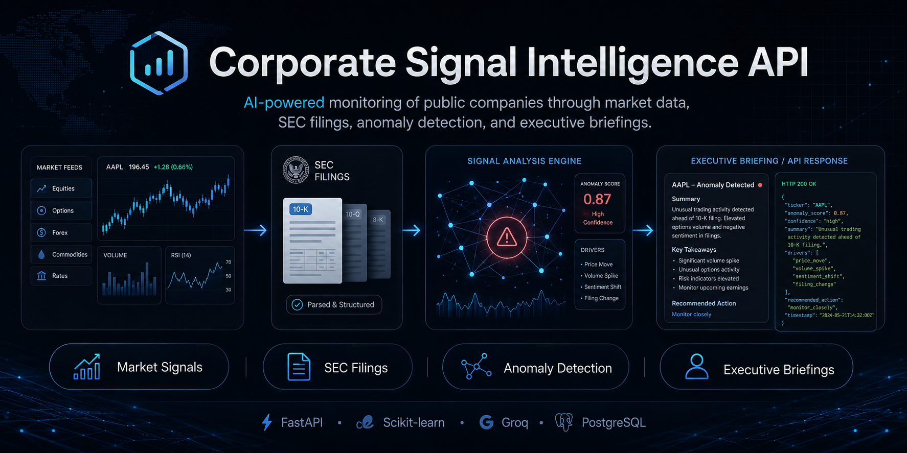
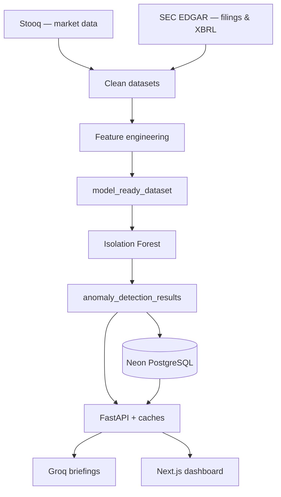
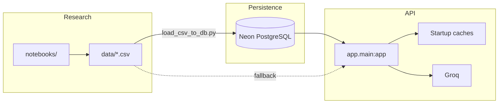

<p align="center">
  
</p>

<h1 align="center">Corporate Signal Intelligence</h1>

<p align="center">
  <strong>SEC filings · market features · Isolation Forest · FastAPI · Groq · Neon PostgreSQL</strong><br />
  <em>From notebooks and market API headaches to a production API on Render.</em>
</p>

<p align="center">
  <a href="https://github.com/sidnei-almeida/corporate-signal-intelligence"><strong>View on GitHub</strong></a>
  &nbsp;·&nbsp;
  <a href="README_API.md">API documentation</a>
  &nbsp;·&nbsp;
  <a href="README_DATABASE.md">Database (Neon)</a>
</p>

<p align="center">
  
  
  
  
  
  
</p>

---

## What this is

I built this project to combine **market data**, **SEC filings**, and **financial fundamentals** in a single pipeline: clean, engineer features, flag atypical days with a benchmarked and validated anomaly detector, and expose everything through an API — with Groq-powered executive briefings when it makes sense.

The pipeline covers **1994–2026** across ten large-cap US technology issuers: 67,912 trading days and 3,941 SEC filings, with every modelling choice tested rather than assumed.

This is not a trading bot or legal memo generator. The goal is to **prioritize what deserves a second look** before someone opens a 10-K or writes a memo.

> **Production API:** `uvicorn app.main:app` — see [README_API.md](README_API.md) for details.

---

## How the project was built

This section is an honest summary of the journey — including what broke along the way.

### Final pipeline



---

### 1. Market data — Alpha Vantage did not hold up

I started with **Alpha Vantage** because it looked simple: `open`, `high`, `low`, `close`, `volume`, `adjusted_close`, etc.

In practice:

- `TIME_SERIES_DAILY_ADJUSTED` → **premium** endpoint error
- `TIME_SERIES_DAILY` with `outputsize=compact` → only ~**100 rows** per ticker
- `outputsize=full` → **503**, quota burning fast

**Conclusion:** dropped as the primary source. At best a complement.

---

### 2. Market data — Stooq became the base

I migrated to **Stooq** (historical CSV). At first Stooq would not return the file — it asked for an API key via captcha. After getting the key, collection worked well.

**10 tickers:** AAPL, MSFT, NVDA, GOOGL, AMZN, META, TSLA, AMD, INTC, ORCL.

| Metric | Value |
|--------|--------|
| Historical rows (approx.) | ~82k |
| Granularity | Daily |
| Coverage | Decades for some names (e.g. INTC since 1972, AAPL since 1984) |

**Stooq = primary market data source.**

---

### 3. Corporate data — SEC EDGAR

The “corporate intelligence” layer came from the **SEC**: metadata, ticker→CIK, submissions, 10-K / 10-Q / 8-K, company facts (XBRL).

First test with AAPL worked (`CIK 0000320193`). Concepts like `Revenues`, `NetIncomeLoss`, `Assets`, `CashAndCashEquivalentsAtCarryingValue` show up under different names across companies and periods.

**Gotcha that looked like a bug:** `start_date` as `NaT` on many facts. Not an error — that is how the SEC models it:

| Type | Dates |
|------|--------|
| **Duration** (revenue, income) | `start_date` + `end_date` |
| **Instant** (assets, cash) | usually `end_date` only |

I standardized on **`reference_date` / `end_date`** as the time axis for fundamentals.

---

### 4. Cleansing — `data_analysis_cleansing.ipynb`

Goal: validate shape, duplicates, nulls, and standardize tickers and dates.

| Clean dataset | Result |
|---------------|--------|
| `clean_market_df` | No relevant nulls/duplicates; filtered from **2015+** |
| `clean_companies_df` | OK |
| `clean_sec_filings_df` | OK |
| `clean_sec_facts_df` | null `start_date` where expected (instant concepts) |

---

### 5. Feature engineering — three layers

In `feature_engineering.ipynb` I split work into three blocks.

**Market features** — returns, volatilities, volume/return z-scores, gaps, etc.  
→ **2,773 rows** per ticker, aligned period (2015–2026).

**Filing features** — 10-K/10-Q/8-K counts, 30d/90d/180d/365d windows, days since last filing.  
→ SEC turned into **daily signals**, not just PDFs on EDGAR.

**Financial features** — the hardest part. XBRL in long format, concepts that rename (`RevenueFromContractWithCustomerExcludingAssessedTax` vs `Revenues`). Consolidated into `revenue`, margins, QoQ/YoY growth, etc.

After the first pivot, **brutal sparsity** (>50% missing on several columns). v2 fix:

- map concepts **before** pivot  
- forward fill by ticker  
- consolidate on `ticker + reference_date`  
- drop still-bad columns (`liabilities*`, ~40% missing)

Output: `financial_features_selected.csv`.

---

### 6. `model_ready_df` — merge and missing values

Two-step join:

1. **Daily:** `market_features` + `filing_features` on `ticker + date`  
2. **Quarterly financials:** `merge_asof` — for each market day, the latest fundamental available up to that date

| | |
|---|---|
| Rows | 27,730 |
| Columns | 58 |
| Companies | 10 |

I tested full `dropna()`: would lose **15.6%** of rows and **100% of AMZN**. Rejected.

**Decision:** `SimpleImputer(median)` inside the modeling pipeline — keeps all companies.

---

### 7. Modeling — Isolation Forest

Without real “fraud” or “crisis” labels, **unsupervised** made more sense.

```text
SimpleImputer(median) → RobustScaler() → IsolationForest(contamination=0.03)
```

Saved as `models/isolation_forest_anomaly_pipeline.joblib`.

Global anomaly rate: **3.00%** (matches `contamination=0.03`).

| Ticker | Anomaly rate |
|--------|----------------|
| TSLA | 7.46% |
| NVDA | 6.60% |
| META | 4.36% |
| GOOGL | 3.53% |
| AAPL | 0.79% |

TSLA and NVDA on top makes sense — more volatility and extreme events in the window.

---

### 8. Anomaly types (rule-based)

After the model score, I classified with rules: `price_spike`, `volume_spike`, `high_volatility`, `filing_activity`, `revenue_shift`, `negative_margin`, `combined_signal`, etc.

The first chart with **concatenated** types became unreadable soup (`price_spike, volume_spike, filing_activity, ...`). Fix: **explode individual labels** — much clearer.

---

### 9. FastAPI

Structured under `app/` (not the legacy first-version `app.py`):

| Area | Endpoints |
|------|-----------|
| System | `/health`, `/` |
| Companies | `/companies`, `/companies/{ticker}` |
| Anomalies | `/anomalies`, `/top`, `/summary`, `/types`, `/{ticker}` |
| Model | `/model/info`, `/model/predict` |
| Briefings | `/briefings/generate`, `/generate-from-record`, `/sample` |

**Data strategy:** v1 with local CSV for fast deploy → then **Neon** with `DATA_SOURCE=auto|database|csv`.

**Groq** (`llama-3.3-70b-versatile`): takes the anomaly record and returns an executive briefing — what happened, why it matters, signals, monitoring — **no investment advice**.

---

### 10. Render deploy — what was painful

It came up and responded, but two classic issues showed up:

**Flapping 200/404 routes** — `/anomalies/summary` sometimes hit `/{ticker}`. Fixed route order (static before dynamic), `normalize_ticker`, ticker validation, and non-mutating cache.

**RAM > 512 MB** — Pandas loading wide CSV, `.copy()`, `groupby` and `explode` on every request on the free tier. Not data leakage; memory limit + initial design.

Mitigations we applied:

- lightweight startup caches (summary, top, types, profiles)  
- minimal columns / SQL on Neon  
- `/health` and `/model/info` without loading joblib  
- `--workers 1`  
- production with **`DATA_SOURCE=database`** when Neon is populated  

---

### 11. Neon + dashboard

PostgreSQL schema, SQLAlchemy, Alembic, `scripts/load_csv_to_db.py` — ~27k rows in `anomaly_results`. Production API reads from the database when `DATABASE_URL` is set.

Frontend in a separate repo: **[corporate-signal-intelligence-dashboard](https://github.com/sidnei-almeida/corporate-signal-intelligence-dashboard)** — Next.js, Tailwind, Recharts. Flow: pick a company → view anomalies → generate Groq briefing.

---

### What worked vs. what did not

| Worked | Did not (or avoid) |
|--------|---------------------|
| **Stooq** — deep history | **Alpha Vantage** — quota, 503, premium |
| **SEC EDGAR** — real corporate data | **`dropna()`** on `model_ready` — kills AMZN |
| **Pandas in notebooks** | **Heavy Pandas in the API** on Render 512MB |
| **Isolation Forest** — solid baseline | **Chart with combined `anomaly_type`** — unreadable |
| **Groq** — useful briefings | Loading full `model_ready` in the API |
| **FastAPI** + OpenAPI | |
| **Neon** as production source | |

---

### In one sentence

A corporate intelligence API that crosses market data (Stooq), filings and fundamentals (SEC), detects atypical days with ML, and generates executive briefings with an LLM — plus a dashboard to consume it visually.

---

## Architecture (technical view)



---

## Documentation

| File | Contents |
|------|----------|
| [README_API.md](README_API.md) | Endpoints, env vars, Render, memory |
| [README_DATABASE.md](README_DATABASE.md) | Migrations, CSV→Neon loader |

---

## Notebooks (in order)

| # | Notebook | Focus |
|---|----------|--------|
| 1 | `data_collection.ipynb` | Stooq + SEC EDGAR (see `scripts/collect_sec_full_history.py` for the lineage-aware collection actually used) |
| 2 | `data_analysis_cleansing.ipynb` | Cleansing, lineage, six-dimension quality scorecard |
| 3 | `exploratory_data_analysis.ipynb` | Normality, stationarity, GARCH, regimes, event study |
| 4 | `feature_engineering.ipynb` | 36 features, look-ahead audit, VIF and PCA |
| 5 | `modeling_anomaly_detection.ipynb` | Ten detectors across six families, one protocol |
| 6 | `model_evaluation_validation.ipynb` | Forward-stress label, Friedman/Wilcoxon, walk-forward, SHAP |

Run any of them headlessly with `python scripts/run_notebook.py notebooks/<name>.ipynb`.
Install the analysis stack with `pip install -r requirements-notebooks.txt` — it is kept
separate from `requirements.txt` so the API deployment stays small.

**Artifacts:** `anomaly_detection_results.csv`, `feature_dictionary.csv`,
`data_quality_report.csv`, `isolation_forest_anomaly_pipeline.joblib`,
`model/training_metrics.json`, and publication-quality figures in `images/figures/`.

---

## What the evaluation found

The detector is measured against a criterion built entirely from data *after* the scoring
date — the largest abnormal return in the following five sessions, relative to the issuer's
own trailing volatility. No model could have fitted it.

| | |
|---|---|
| Base rate of material days | 4.3% |
| Precision at a 1% alert budget | 11.4% |
| **Lift over random inspection** | **2.67×** |
| Detectors benchmarked | 10, across 6 families |
| Statistical comparison | Friedman over 84 issuer-year blocks, χ² = 77.3, p = 5.6e-13 |

The uncomfortable finding is the interesting one: **the best detector is the conditional
baseline** — the largest rolling z-score across return, volume and range. Isolation Forest,
LOF, KNN, ECOD, COPOD, HBOS, One-Class SVM, Mahalanobis and an autoencoder were all
benchmarked, and none measurably beats it. The value delivered here is in how the features
were built, not in the model fitted on top of them. The Isolation Forest still ships as a
secondary *structural* score, since it answers a different question the label cannot judge.

Full write-up with the numbers and caveats: [docs/tcc_evidence.md](docs/tcc_evidence.md).

---

## Anomaly fields (for the frontend)

| Field | Usage |
|-------|--------|
| `is_anomaly` | **Primary flag** in the UI |
| `anomaly_label` | `-1` = anomaly, `1` = normal |
| `anomaly_score` | Lower = more anomalous |
| `anomaly_type` | Tags (`price_spike`, `filing_activity`, …) |

---

## Quick start

```bash
git clone https://github.com/sidnei-almeida/corporate-signal-intelligence.git
cd corporate-signal-intelligence

python -m venv .venv
source .venv/bin/activate
pip install -r requirements.txt

cp .env.example .env   # never commit .env

uvicorn app.main:app --reload --host 0.0.0.0 --port 8000
```

**Docs:** http://localhost:8000/docs

**With Neon:**

```bash
alembic upgrade head
python scripts/load_csv_to_db.py --truncate
```

---

## Repository structure

```
corporate-signal-intelligence/
├── app/                    # FastAPI (production)
├── alembic/                # Migrations
├── data/                   # Pipeline CSVs
├── models/                 # .joblib
├── model/                  # feature_schema.json, metrics
├── notebooks/              # Research and training
├── scripts/                # load_csv_to_db, inspect_model
├── images/                 # header.png
├── render.yaml
└── README_*.md
```

---

## Deploy (Render)

1. Push to GitHub  
2. Web Service + `render.yaml`  
3. Start: `uvicorn app.main:app --host 0.0.0.0 --port $PORT --workers 1`  
4. Secrets: `GROQ_API_KEY`, `DATABASE_URL`, …  
5. `DATA_SOURCE=database` with Neon loaded  

```bash
curl -s https://corporate-signal-intelligence.onrender.com/health | jq
```

> Free tier sleeps when idle; first request may take ~30–60s.

---

## Disclaimer

**Portfolio and learning project.** Model scores and Groq text are **not investment advice** or official filing interpretation. Always validate against primary sources.

---

## License & author

**[MIT License](LICENSE)**

**Sidnei Alves de Almeida** — [@sidnei-almeida](https://github.com/sidnei-almeida)
