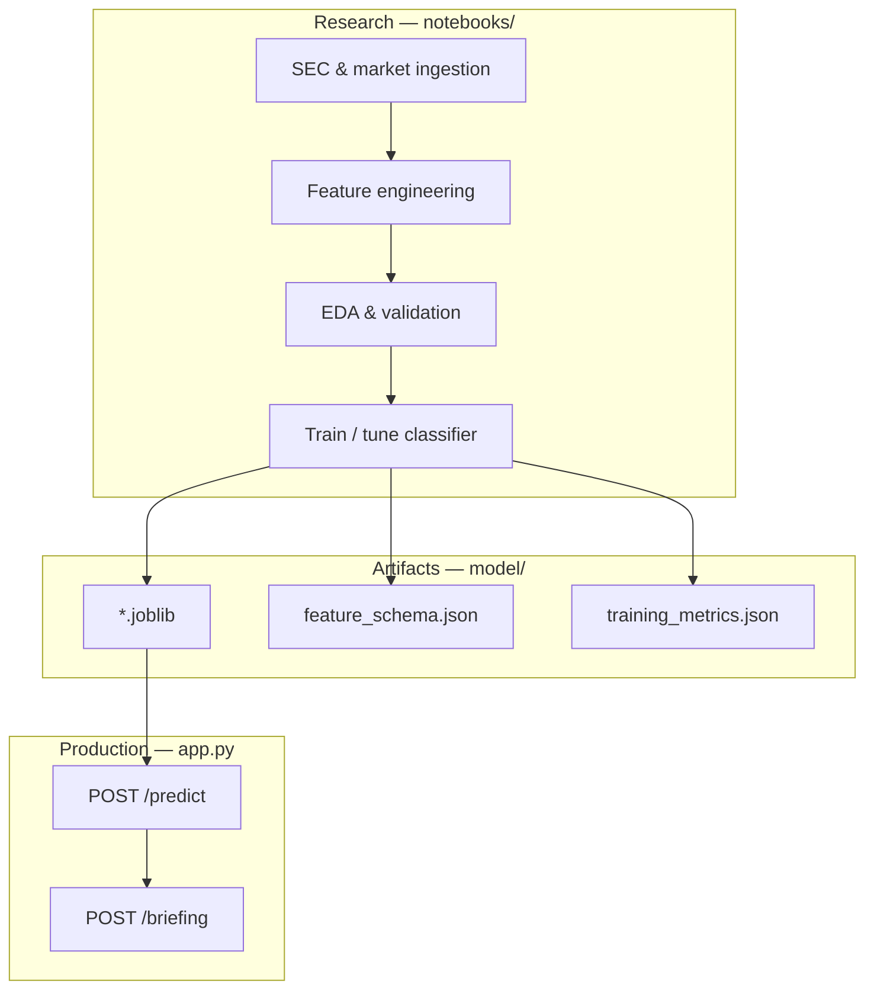

<p align="center">
  
</p>

<p align="center">
  <strong>Python · scikit-learn · SEC &amp; market features · FastAPI · Groq</strong><br />
  <em>End-to-end corporate signal monitoring: research notebooks, anomaly classifier (<code>model/*.joblib</code>), and a production API on Render.</em>
</p>

<p align="center">
  <a href="https://github.com/sidnei-almeida/corporate-signal-intelligence"><strong>github.com/sidnei-almeida/corporate-signal-intelligence</strong></a>
</p>

<p align="center">
  
  
  
  
  
</p>

---

## Executive summary

**Corporate Signal Intelligence** is a portfolio-grade analytics stack that combines **regulatory filings**, **market behaviour**, and **supervised machine learning** to flag companies whose recent signals look **atypical** relative to the training distribution. The research phase lives in **`notebooks/`**; the serialized estimator lives in **`model/*.joblib`**; scoring and optional **Groq** executive briefings are exposed through **`app.py`** (FastAPI), deployable on **Render’s free web tier**.

The goal is not to replace compliance teams or investment committees — it is to **prioritize review**: surface issuers that merit a closer read of SEC disclosures, price action, and governance cues before analysts write a memo.

---

## Problem & approach

| Challenge | Response in this project |
|-----------|---------------------------|
| Filings and prices are high-volume | Structured features per issuer / period (ratios, delays, market moves) |
| Anomalies are sparse and costly to miss | Binary classifier: **normal** vs **anomaly** with probability scores |
| Stakeholders need narrative context | Optional **`POST /briefing`** (Groq) from ML output + your notes |
| Models must be usable outside Jupyter | **REST API** with OpenAPI docs |



---

## Data & feature design

Features are built to proxy **financial health**, **market stress**, and **governance / disclosure friction**. The API contract is documented in **`model/feature_schema.json`** (synced automatically from sklearn when you run `scripts/inspect_model.py`).

| Feature | Role in analysis |
|---------|------------------|
| `revenue_growth_yoy` | Top-line momentum vs. prior year |
| `net_margin` | Profitability quality |
| `debt_to_equity` | Leverage risk |
| `current_ratio` | Short-term liquidity |
| `cash_flow_volatility` | Stability of cash generation |
| `market_cap_change_30d` | Recent market repricing |
| `filing_delay_days` | SEC reporting timeliness (governance signal) |
| `insider_sell_ratio` | Insider trading skew (sentiment / alignment) |

**Target:** `0` = **normal**, `1` = **anomaly** (issuer-period rows that diverge from the learned “regular” pattern in training data).

Typical sources in the notebooks (project-specific paths may vary):

- **SEC EDGAR** — 10-K / 10-Q timing, fundamentals where extracted  
- **Market data** — prices, market cap, returns (e.g. `yfinance` or vendor APIs)  
- **Derived ratios** — margins, leverage, liquidity from financial statements  

---

## Research workflow (`notebooks/`)

The Jupyter workstreams document the full study — from raw pulls to the artifact you serve in production. Open each notebook in order (filenames may vary slightly in your clone):

| Phase | Typical focus | Outcomes |
|-------|----------------|----------|
| **1. Ingestion** | Tickers, CIK mapping, filing dates, price history | Clean panel dataset (issuer × period) |
| **2. Feature engineering** | Ratios, rolling volatility, insider activity, filing lag | Model-ready matrix + train/test split |
| **3. Exploratory analysis** | Distributions, correlation heatmaps, class balance, outliers | Hypotheses on which signals drive “anomaly” |
| **4. Modeling** | Baseline + tuned sklearn model (e.g. Random Forest, Gradient Boosting, Logistic Regression) | Cross-validated metrics, confusion matrix |
| **5. Evaluation** | Hold-out test, precision/recall on **anomaly** class, error analysis | `model/training_metrics.json` + `model/*.joblib` |

**Analytical themes** explored in EDA (aligned with the feature set above):

- Whether **filing delays** and **insider sell pressure** co-occur with model-flagged anomalies  
- How **margin compression** and **negative market-cap drift** cluster in the positive class  
- Trade-off between **precision** (avoid false alarms) and **recall** (catch risky issuers) on imbalanced labels  

After training, export metrics into **`model/training_metrics.json`** (template created by `inspect_model.py`) so **`GET /model/info`** can expose them to dashboards.

---

## Production API

The dashboard concept below consumes the same backend you deploy on Render: charts call **`/predict`**, narrative cards call **`/briefing`** when `GROQ_API_KEY` is set.

<p align="center">
  
</p>

<p align="center">
  <sub>Example UI: company watchlist, anomaly score, and LLM-generated executive summary.</sub>
</p>

### Endpoints

| Method | Path | Description |
|--------|------|-------------|
| GET | `/` | Service index |
| GET | `/health` | `ok` or `model_not_loaded` |
| GET | `/model/info` | Features, labels, optional `training_metrics.json` |
| POST | `/predict` | Score one feature map |
| POST | `/predict/batch` | Score many rows |
| POST | `/briefing` | Groq executive summary (optional) |

Interactive docs: **`/docs`**

### Example

```bash
curl -s -X POST "https://your-app.onrender.com/predict" \
  -H "Content-Type: application/json" \
  -d '{
    "features": {
      "revenue_growth_yoy": -2.1,
      "net_margin": 1.4,
      "debt_to_equity": 2.8,
      "current_ratio": 0.9,
      "cash_flow_volatility": 0.72,
      "market_cap_change_30d": -18.5,
      "filing_delay_days": 62,
      "insider_sell_ratio": 0.81
    }
  }'
```

---

## Repository layout

```
corporate-signal-intelligence/
├── app.py                      # FastAPI (inference + briefing)
├── requirements.txt
├── render.yaml                 # Render Blueprint (free tier)
├── runtime.txt
├── .env.example
├── notebooks/                  # EDA, training, evaluation (your analysis)
├── model/
│   ├── *.joblib                # Trained estimator (commit or Git LFS)
│   ├── feature_schema.json     # API feature contract
│   └── training_metrics.json   # Test metrics from notebooks (optional)
├── scripts/
│   └── inspect_model.py        # Sync schema + metrics template from .joblib
├── images/
│   ├── header.png
│   └── software.png
└── LICENSE
```

---

## Local setup

```bash
git clone https://github.com/sidnei-almeida/corporate-signal-intelligence.git
cd corporate-signal-intelligence

python -m venv .venv
source .venv/bin/activate

pip install -r requirements.txt

# After placing your artifact:
python scripts/inspect_model.py

cp .env.example .env   # optional GROQ_API_KEY
uvicorn app:app --reload --host 0.0.0.0 --port 8000
```

---

## Deploy on Render (free)

1. Push the repo (include **`model/*.joblib`**; use **Git LFS** if the file is large).  
2. Render → **New Web Service** → connect GitHub.  
3. Use **`render.yaml`** or set manually:  
   - **Build:** `pip install -r requirements.txt`  
   - **Start:** `uvicorn app:app --host 0.0.0.0 --port $PORT`  
4. Environment variables:  
   - `GROQ_API_KEY` — optional, for `/briefing`  
   - `GROQ_MODEL` — optional (default `llama-3.3-70b-versatile`)  
   - `MODEL_PATH` — optional override for the `.joblib` path  

**Free tier:** services sleep when idle; first request after sleep may take 30–60s. Call **`GET /health`** to wake the instance.

---

## Environment variables

| Variable | Required | Description |
|----------|----------|-------------|
| `PORT` | On Render | Set by platform |
| `MODEL_PATH` | No | Override path to `.joblib` |
| `GROQ_API_KEY` | For `/briefing` | Groq API key |
| `GROQ_MODEL` | No | LLM id |

---

## Disclaimer

This project is for **education and portfolio demonstration**. Model output and LLM briefings are **not** investment advice, legal opinions, or SEC filing interpretations. Always validate signals against primary sources and professional review.

---

## License

Released under the **[MIT License](LICENSE)**.

---

## Author

**Sidnei Alves de Almeida** — [@sidnei-almeida](https://github.com/sidnei-almeida)
